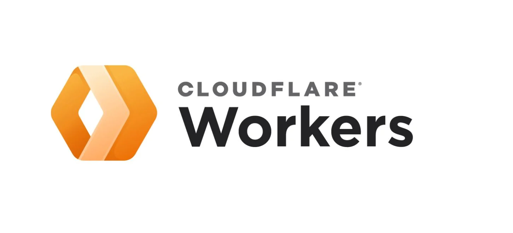

# Cloudflare Workers

A collection of Cloudflare Workers developed and maintained by Carlos Tormo Castaño.

This repository contains small backend services and APIs used by my personal projects and portfolio.

## Cloudflare

[](https://dash.cloudflare.com/)

## Workers

### AI Assistant

[](https://ai-assistant.carlostcdev.workers.dev)

AI backend for the chatbot integrated into my portfolio.

It uses **Google Gemini** to generate responses based on a professional context defined in `AGENT.md`. The Worker receives the conversation history from the frontend and streams Gemini's response back to the client.

Production API: [ai-assistant.carlostcdev.workers.dev](https://ai-assistant.carlostcdev.workers.dev)

---

### FIDS

[](https://fids.carlostcdev.workers.dev)

Backend API for the Flight Information Display System used by my FIDS project.

It provides flight schedule information through **AirLabs** while keeping the AirLabs API key securely stored as a Cloudflare Worker Secret instead of exposing it to the frontend.

Production API: [fids.carlostcdev.workers.dev](https://fids.carlostcdev.workers.dev)

---

# Creating a Worker

## 1. Install Node.js

Install [Node.js](https://nodejs.org/) and verify the installation:

```bash
node --version
npm --version
```

## 2. Create the Worker

Create a new Cloudflare Worker project:

```bash
npm create cloudflare@latest
```

Select:

```text
Hello World example
Worker only
TypeScript
```

Choose whether to add `AGENTS.md` according to your needs.

You can deploy during the setup or deploy it later manually.

## 3. Enter the project

```bash
cd <worker-name>
```

The project will contain the main Worker files, including:

```text
src/
wrangler.jsonc
package.json
tsconfig.json
```

The Worker entry point is normally:

```text
src/index.ts
```

## 4. Configure the Worker

The Worker name and entry point are defined in `wrangler.jsonc`:

```jsonc
{
    "name": "my-worker",
    "main": "src/index.ts"
}
```

Use the name you want for the Worker.

## 5. Add Secrets

If the Worker requires API keys or other sensitive values, store them as Cloudflare Secrets instead of putting them in the source code:

```bash
npx wrangler secret put API_KEY
```

Check the configured Secrets:

```bash
npx wrangler secret list
```

Never commit API keys or other credentials to the repository.

## 6. Test locally

Start the local development server:

```bash
npm run dev
```

Wrangler will provide a local URL where the Worker can be tested.

## 7. Deploy

When the Worker is ready:

```bash
npm run deploy
```

The Worker will be deployed to its configured Cloudflare environment.

## 8. Connect GitHub

For automatic deployments, connect the Worker to this GitHub repository through **Cloudflare Workers & Pages**.

For a monorepo, configure the Worker to use its own directory as the root directory, depending on the Worker.

After that, pushing a commit to GitHub will trigger the corresponding Cloudflare Workers Build.

# Repository Structure

```text
carlostcdev-workers/
├── ai-assistant/
│   ├── src/
│   ├── test/
│   ├── package.json
│   └── wrangler.jsonc
│
├── fids/
│   ├── src/
│   ├── test/
│   ├── package.json
│   └── wrangler.jsonc
│
├── docs/
├── .gitignore
├── LICENSE.txt
└── README.md
```

Each Worker is maintained independently while sharing the same repository.

## Deployment workflow

```text
Edit Worker
     ↓
git add .
     ↓
git commit
     ↓
git push
     ↓
GitHub
     ↓
Cloudflare Workers Builds
     ↓
Worker deployment
```
